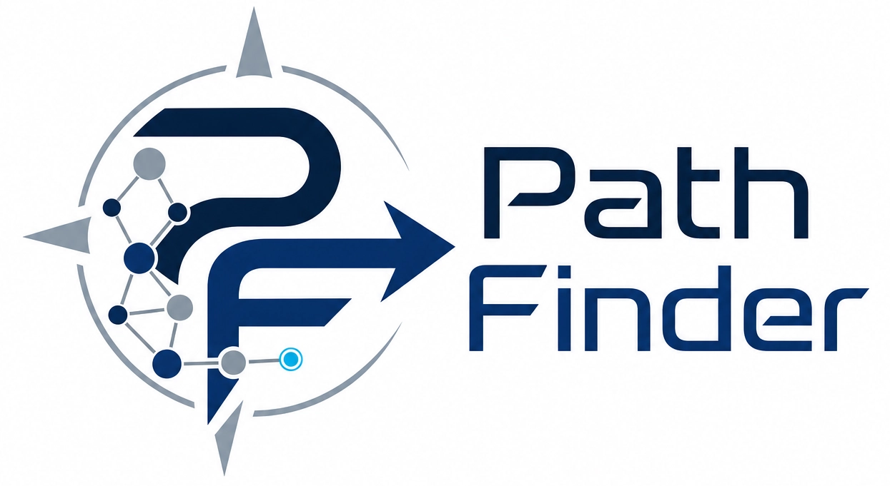

<h1 align="center">
path_finder
</h1>

**Retrosynthesis route finder** — AiZynthFinder · Rxn-INSIGHT · Chemistry by Design

*Yara Chahda · Corentin Portmann · Inès Ouchen Laksiri — EPFL 2026*

---
 
## User installation
 
> **Requirements:** macOS or Linux, [Miniconda or Anaconda](https://docs.conda.io/en/latest/miniconda.html)
 
### 1. Create a dedicated environment
 
Python 3.10 is required — newer versions are not compatible with AiZynthFinder.
 
```bash
conda create -n path-finder-env python=3.10 -y
conda activate path-finder-env
```
 
### 2. Install RDKit
 
RDKit cannot be installed via pip — conda is required for this one step.
 
```bash
conda install -c conda-forge rdkit -y
```
 
### 3. Install Path Finder
 
```bash
pip install path-finder-retrosynthesis
```
 
### 4. Run the setup wizard
 
```bash
path-finder-setup
```
 
This automatically:
- copies the bundled datasets into `data/`
- creates `data/config.yml` with the correct paths
> **If the wizard fails at step 3 (model download):** download the files manually from
> [https://github.com/MolecularAI/aizynthfinder/releases](https://github.com/MolecularAI/aizynthfinder/releases)
> and place them in `data/aizynthfinder/`.
>
> Files needed: `uspto_model.onnx`, `uspto_templates.csv.gz`, `uspto_filter_model.onnx`, `zinc_stock.hdf5`
 
### 5. Download the Rxn-INSIGHT USPTO database
 
Download `uspto_rxn_insight.gzip` from:
[https://zenodo.org/records/10171745](https://zenodo.org/records/10171745)
 
Place it in `data/uspto_rxn_insight.gzip`.
 
> This file enables reaction condition prediction for novel routes.
> Without it, only dataset and validated routes are shown.
 
### 6. Launch
 
```bash
path-finder
```
 
Open [http://localhost:8501](http://localhost:8501) in your browser.
 
---
 
## Quick summary
 
```bash
conda create -n path-finder-env python=3.10 -y
conda activate path-finder-env
conda install -c conda-forge rdkit -y
pip install path-finder-retrosynthesis
path-finder-setup
# → place data/uspto_rxn_insight.gzip manually
path-finder
```
 
---

## What the app does

Path Finder finds and ranks retrosynthesis routes for a target molecule using three sources:

| Section | Source | Conditions | Yield in scoring |
|---------|--------|------------|-----------------|
| 📚 Dataset | Curated Chemistry by Design routes | Real | Yes |
| ✅ Validated | AiZynthFinder + generic reactions (USPTO) | Real | Yes |
| 🤖 Predicted | AiZynthFinder + Rxn-INSIGHT | Predicted | No |

Routes are scored using a weighted 1/i² scheme across three user-chosen criteria:
steps, yield, atom economy, E-factor, or safety.

---

## Data files

| File | Bundled | Description |
|------|---------|-------------|
| `reaction_dataset.json` | ✅ | Curated synthesis routes |
| `toxicity_dataset.json` | ✅ | Safety scores for reagents and solvents |
| `generic_reactions.json` | ✅ | 10 000 USPTO reactions for step validation |
| `data/aizynthfinder/` | ❌ | AiZynthFinder model files — downloaded by wizard |
| `data/config.yml` | ❌ | Generated by wizard — do not commit |
| `data/uspto_rxn_insight.gzip` | ❌ | Rxn-INSIGHT USPTO database — download manually |

The construction, sources and reconstruction procedure of toxicity_dataset.json are documented in SOURCES_ET_RECONSTRUCTION.md.
---
 
## Troubleshooting
 
| Problem | Solution |
|---------|----------|
| `path-finder-setup` not found | Make sure `path-finder-env` is activated: `conda activate path-finder-env` |
| `config.yml not found` when launching | Run `path-finder-setup` first |
| AiZynthFinder model download fails | Download manually from [releases page](https://github.com/MolecularAI/aizynthfinder/releases) and place in `data/aizynthfinder/` |
| AiZynthFinder crash on launch | Open `data/config.yml` and make sure all paths are absolute and the files exist |
| Predicted routes disabled | Place `data/uspto_rxn_insight.gzip` (see step 5 above) |
| Slow search (~2 min) | Normal — AiZynthFinder MCTS is computationally intensive |
| Wrong Python version error | Make sure you created the environment with `python=3.10` |
 
---

## Developer setup
 
```bash
git clone https://github.com/YaraChahda/path_finder.git
cd path_finder
conda create -n path-finder-dev python=3.10 -y
conda activate path-finder-dev
conda install -c conda-forge rdkit -y
pip install -e .
path-finder-setup
path-finder
```
 
### Running tests
 
```bash
pytest tests/
```
 
---
 
## Repository structure
 
This section describes the purpose of every file and folder so that new
contributors can orient themselves quickly.
 
### Root-level files
 
| File | Purpose |
|------|---------|
| `pyproject.toml` | Package metadata, dependencies, and entry points for `pip install` |
| `path_finder-env.yml` | Conda environment — use this to recreate the full dev environment |
| `README.md` | This file |
| `LICENSE` | MIT licence |
| `mypy.ini` | Type-checking configuration — ignores RDKit and Rxn-INSIGHT stubs |
| `.gitignore` | Files excluded from git (config.yml, model files, pycache, dist/) |
| `.pre-commit-config.yaml` | Pre-commit hooks — checks for large files and merge conflicts |
| `.readthedocs.yml` | Automatic documentation build on readthedocs.org |
| `tox.ini` | Test automation configuration |
 
---
 
### `.github/workflows/`
 
| File | Purpose |
|------|---------|
| `publish.yml` | Automatically builds and uploads to PyPI when a git tag is pushed |
 
---
 
### `assets/`
 
| File | Purpose |
|------|---------|
| `banner.png` | Project banner displayed at the top of this README |
| `coverage-badge.svg` | Test coverage badge auto-generated by the CI pipeline |
 
---
 
### `data/`
 
Working data directory — none of these files are committed to git.
 
| File / Folder | Purpose |
|---------------|---------|
| `aizynthfinder/` | AiZynthFinder model files downloaded by `path-finder-setup` |
| `config.yml` | AiZynthFinder config created by `path-finder-setup` — contains absolute paths specific to each machine |
| `reaction_dataset.json` | Main curated dataset (also bundled in the pip package) |
| `toxicity_dataset.json` | Safety scores (also bundled in the pip package) |
| `generic_reactions.json` | 10 000 USPTO reactions for step validation (also bundled) |
| `uspto_rxn_insight.gzip` | Rxn-INSIGHT USPTO database — download manually, enables predicted routes |
 
---
 
### `docs/`
 
| Folder / File | Purpose |
|---------------|---------|
| `source/conf.py` | Sphinx documentation configuration |
| `source/index.md` | Documentation home page |
| `source/api/` | Auto-generated API reference pages |
| `docs_out/` | Generated Sphinx HTML output — do not edit manually, rebuilt with `make html` |
 
---
 
### `notebooks/`
 
| File | Purpose |
|------|---------|
| `report.ipynb` | Project report — introduction, methods, results, discussion, and live code demonstrations |
| `screenshots/` | Screenshots of the Streamlit interface used as figures in the report |
 
---
 
### `scripts/`
 
| File | Purpose |
|------|---------|
| `convert_orderly_to_generic.py` | Converts the ORDerly-cleaned USPTO Parquet file into `generic_reactions.json` — run once to rebuild the generic dataset from scratch |
 
---
 
### `src/path_finder/`
 
The installable Python package. All application logic lives here.
 
| File | Purpose |
|------|---------|
| `__init__.py` | Package entry point — exposes `find_best_routes` and `__version__` |
| `_about_.py` | Single source of truth for the version number |
| `app.py` | Streamlit front-end — tab layout, sidebar, route cards, search logic |
| `app_utensils.py` | UI helper functions used by `app.py` — score tables, scheme HTML, chart builders |
| `route_engine.py` | Chemistry backend — dataset loading, AiZynthFinder, Rxn-INSIGHT, scoring, and the main `find_best_routes()` entry point |
| `molecule_rendering.py` | RDKit Cairo rendering — `mol_png()` for Streamlit images, `mol_b64_or_text_svg()` for embedded HTML schemes |
| `app_layout.py` | All user-visible strings in English and French, plus the colour palette |
| `report_builder.py` | PDF generation using PIL — multi-page A4 report with metric cards, score table, and reaction step images |
| `launch.py` | Console entry points — `path-finder` (launches Streamlit) and `path-finder-setup` (setup wizard) |
| `assets/banner.png` | Banner bundled in the pip package |
| `data/` | Datasets and config template bundled in the pip package, copied to `data/` on first run |
 
---
 
### `tests/`
 
| File | Purpose |
|------|---------|
| `conftest.py` | Shared pytest fixtures (sample routes, mock datasets) |
| `test_route_engine.py` | Tests for scoring functions, dataset loading, SMILES canonicalisation, and route ranking |
| `test_molecule_rendering.py` | Tests for PNG rendering, base64 encoding, and fallback data URIs |
| `test_app_layout.py` | Tests that all required keys exist in both EN and FR dictionaries |
| `test_report_builder.py` | Tests for PDF generation |
| `test_app_utensils.py` | Tests for UI helper functions |
| `test_app.py` | Integration tests for the Streamlit app |
| `test_launch.py` | Tests for the CLI entry points |
 
